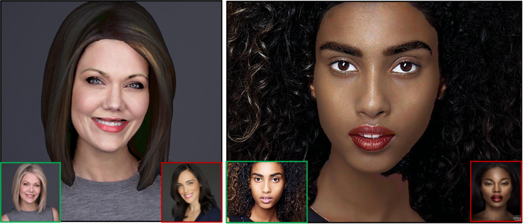

# Digital Makeup Using Machine Learning Algorithms
# A Final Year Project
### Surabhi Malani
### Nanyang Technological University

## Main Code
1. Landscape Final Colour Transfer
2. Part to Part Hair Colour Segmented
3. Part to Part Hair Colour Unsegmented
4. Part to Part Skin Colour Unsegmented
5. Part to Part Eyebrows Color Unsegmented
6. Part to Part Lips Colour Unsegmented
7. Final Face Colour Transfer

### Full Face Colour Transfer 

Illustrates the final results of applying the N-dimensional colour transfer algorithm  on original, unsegmented images with Face-Parsing.PyTorch for ALL of the features. Results (black); Source (red); Target (green). 

Source: Adapted from [A42, A23, A30, A37].

## References  
link 1: https://github.com/ptallada/colour_transfer/blob/master/colour_transfer.py  

link 2: https://github.com/frcs/colour-transfer

link 3: https://github.com/TadasBaltrusaitis/OpenFace

link 4: https://github.com/zllrunning/face-parsing.PyTorch

link 5: https://github.com/zllrunning/facetools

link 6: https://github.com/zllrunning/face-makeup.PyTorch

link 7: https://github.com/shelhamer/fcn.berkeleyvision.org

link 8: https://pytorch.org/hub/pytorch_vision_fcn_resnet101

link 9: https://gluon-cv.mxnet.io/build/examples_segmentation/train_fcn.html

## Image Credits

[A4] 	Zll, (2019) face-parsing.PyTorch [Source code]. https://github.com/zllrunning/face-parsing.PyTorch.

[A7] 	My Modern Met, Photographer Travels Around the World to Capture the Unique Beauty of Red Hair, 2017.

[A8] 	Google Images, Cindy Luo.

[A9] 	CEO Portraits, Entrepreneurs Pictures.

[A10] 	Bambini Photography, Corporate and Graduation Portraits.

[A11] 	ImageFitz, Professional Headshots, 2017.

[A12] 	SrkHeadShotDay, A Graduate Headshot is a Great Gift For A College Student, 2014.

[A13]	 A. D. Rogers, Alex D Rogers Photography Studio: Heads, 2020.

[A14] 	SrkHeadShotDay, A White Background Headshot is Great for Social Media, 2015.

[A15] 	SrkHeadShotDay, Master the Go-To Expression, 2015.

[A16] 	S. R. Kline,  ScottRKlinePhoto What Wardrobe is Best for my Headshot, 2013.

[A17] 	C. Gillett, Chris Gillett Photography: White Background Headshots Portfolios, 2020.

[A18] 	King Street Photo Studio, Professional Actor/Actress Headshots, 2019.

[A19] 	B. Thompson, 10 Enchanting Shades of Purple Hair You Will Flip Over, 2018.

[A20] 	Pinterest, Why Are Today's Women Going Grey at 25?

[A21] 	WallpaperFlare, HD Wallpaper.

[A22] 	KDramaDaily, K-Pop Idols Who Slay With Violet Color Hair, 2019.

[A23] 	K. Williams, KellyWilliamsPhotography: Corporate Headshots and Portraits, 2020.

[A24] 	L. Marie, LizMariePortraits Personal Branding Photography.

[A25] 	S. Wasio, Y. Wasio, WasioFaces Headshot Tips for Women, 2020.

[A26] 	K. Fasanella, Margot Robbie's Red Glitter and Red Lipstick Combo is The Ultimate Holiday Makeup Inspiration, 2018.

[A27] 	D. Dash, Portrait of a woman on white.

[A28] 	J. Walliis, Wallis Photography: Corporate Headshots Women: Professional Business Headshots for Women.

[A29] 	Pinterest, Professional Headshots Chicago - Family & Child Photographer.

[A30] 	N. Cristy, Pintura: The Latest Color Technique for Highlighting Curly Hair. 2019.

[A31] 	"GluonCV: a Deep Learning Toolkit for Computer Vision", Gluon-cv.mxnet.io.

[A32] 	T. W. Corvo, Why Do I Chop Off Tops of Heads? 2020.

[A33] 	C. Marcus, 31 Amazing Pink Hair Color Ideas Trending Right Now, 2020.

[A34] 	K. Pasola, 15 of the best blue hair inspiration pictures on Instagram, 2019.

[A35] 	A. Leibovitz, Annie Leibovitz Captures The Stars In Vanity Fair's Women In Hollywood Issue, 2016.

[A36] 	Pinterest, Angelina Jolie Skinny, 2020.

[A37] 	A. Flinn, Amazing Lipstick Looks for Dark Skin, 2014.

[A38] 	M. Erial, Makeup Brushes You Need: Real Techniques Starter Set, 2018.

[A39]  	L. Hancock, Why I Love Shooting Actor Headshots, 2018.

[A40] 	Freepik, Portrait Young Blonde Woman With Clear Skin. 

[A41] 	Tumblr, Poison Nightmares: TemperHair.

[A42] 	C. Gillett, Chris Gillett Photography: Dark Background Headshots Portfolios, 2020.

[A43]	Pinterest, Dark Beauty.

[A44] 	V. Daniel, Professional Studio Headshots (n.d).

[A45] 	J. Caravalho, Toronto Photographerz: Exposures Photography, 2019.

[A46] 	JMPhotography, At First Sight: How to Ensure Your Professional Headshot Has Style, 2019.